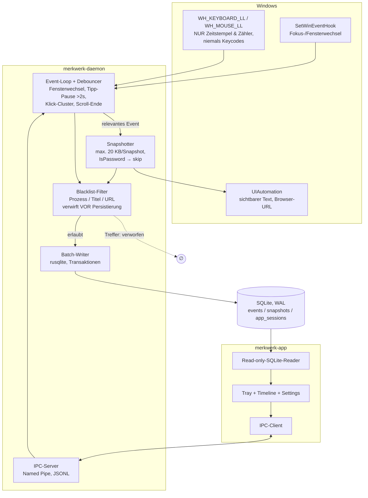

# MerkWerk — Architektur (Stand: Etappe 0)

MerkWerk ist eine Windows-Desktop-App, die 24/7 Bildschirmaktivität erfasst und
(ab Etappe 1) per lokaler KI zu Markdown-Notizen destilliert. Etappe 0 baut das
Skelett: Capture-Daemon + Rohdaten-Timeline, ohne KI.

## Komponenten

Zwei Prozesse, klare Verantwortung:

1. **`merkwerk-daemon`** (Rust, eigenständiges Binary)
   Erfasst Events, macht Kontext-Snapshots, filtert (Blacklist, Passwortfelder),
   schreibt gebatcht in SQLite. Läuft headless, startet per Autostart (30 s verzögert).
   Der Daemon ist der **einzige Schreiber** der Datenbank.

2. **`merkwerk-app`** (Tauri 2 + React + TypeScript + Vite)
   Tray-Icon (Start/Pause, Status), Timeline-Fenster, Settings mit
   Blacklist-Editor und Autostart-Toggle. Liest die SQLite-DB **read-only**
   (WAL erlaubt parallele Leser), steuert den Daemon über IPC (Named Pipe).

## Datenfluss



Kernprinzip: **Filterung an der Quelle.** Blacklist-Treffer und Passwortfelder
erreichen die DB nie; Roh-Tastenanschläge existieren nirgends — die
Low-Level-Hooks reduzieren jedes Tastatur-Event noch im Hook-Callback auf
„ein Tastendruck fand statt um Zeitpunkt t". Keycodes verlassen den Callback nicht.

## Daemon-Threads

| Thread | Aufgabe |
|---|---|
| Hook-Thread (STA, Message-Loop) | `SetWinEventHook` + LL-Hooks; Events → Channel |
| UIA-Thread (MTA) | UIAutomation-Snapshots (UIA-Aufrufe gehören nicht auf den Hook-Thread) |
| Writer-Thread | Batching + SQLite-Commits (Intervall/Größe) |
| IPC-Thread | Named-Pipe-Server, Steuerkommandos |

Kommunikation über `crossbeam-channel`. Ziel: <5 % CPU, <200 MB RAM.

## DB-Schema (v0, migrierbar)

```sql
PRAGMA journal_mode = WAL;

-- Schema-Versionierung für spätere Migrationen (FTS5, sqlite-vec in Etappe ≥1)
CREATE TABLE meta (key TEXT PRIMARY KEY, value TEXT NOT NULL);

-- Zusammenhängende Nutzung einer App (Fokus-Intervall)
CREATE TABLE app_sessions (
    id           INTEGER PRIMARY KEY,
    process_name TEXT NOT NULL,           -- z. B. "chrome.exe"
    started_at   INTEGER NOT NULL,        -- Unix-ms
    ended_at     INTEGER,                 -- NULL = läuft noch
    expires_at   INTEGER                  -- TTL; Löschjob in Etappe 1
);

-- Niederfrequente Ereignisse (Fokuswechsel, Aktivitätsfenster)
CREATE TABLE events (
    id           INTEGER PRIMARY KEY,
    session_id   INTEGER REFERENCES app_sessions(id),
    kind         TEXT NOT NULL,           -- 'focus_change' | 'typing_burst' |
                                          -- 'click_cluster' | 'scroll_end' | 'idle'
    ts           INTEGER NOT NULL,        -- Unix-ms
    duration_ms  INTEGER,                 -- z. B. Länge des Tipp-Bursts
    count        INTEGER,                 -- z. B. Anzahl Klicks im Cluster
    expires_at   INTEGER
);

-- Kontext-Snapshots (der eigentliche Rohstoff für die spätere KI)
CREATE TABLE snapshots (
    id           INTEGER PRIMARY KEY,
    session_id   INTEGER REFERENCES app_sessions(id),
    event_id     INTEGER REFERENCES events(id),
    ts           INTEGER NOT NULL,
    window_title TEXT,
    url          TEXT,                    -- nur Browser, aus UIA-Adressleiste
    text_content TEXT,                    -- sichtbarer UIA-Text, max. 20 KB
    text_bytes   INTEGER NOT NULL DEFAULT 0,
    truncated    INTEGER NOT NULL DEFAULT 0,
    expires_at   INTEGER
);

CREATE INDEX idx_sessions_started ON app_sessions(started_at);
CREATE INDEX idx_events_ts        ON events(ts);
CREATE INDEX idx_snapshots_ts     ON snapshots(ts);
```

Anbaubarkeit für später: `snapshots.text_content` bleibt eigene Spalte, sodass
eine FTS5-Contentless-Tabelle (`content=snapshots`) und eine
sqlite-vec-Embedding-Tabelle (`snapshot_id` als FK) ohne Umbau andocken können.
Alle Rohdaten-Tabellen tragen ab Tag 1 `expires_at` (TTL); der Löschjob kommt
in Etappe 1.

## Privacy-Invarianten (nicht verhandelbar)

1. **Keine Roh-Tastenanschläge.** Hook-Callbacks geben ausschließlich
   `(Zeitstempel, Ereignisart)` weiter — kein `vkCode`, kein `scanCode`, auch
   nicht in Logs/Debug-Ausgaben. Modulgrenze erzwingt das: der Typ, der den
   Hook-Thread verlässt, enthält schlicht kein Feld dafür.
2. **`IsPassword`-Elemente** werden im UIA-Walker komplett übersprungen
   (Element UND Subtree).
3. **Blacklist wirkt an der Quelle:** Treffer auf Prozessname, Fenstertitel-
   oder URL-Muster → Event/Snapshot wird verworfen, bevor er den Writer erreicht.
4. Snapshot-Text ist auf 20 KB gedeckelt (`truncated`-Flag).

## Konfiguration

TOML unter `%APPDATA%\MerkWerk\config.toml` (Blacklist, DB-Pfad, TTL,
Debounce-Parameter). Daemon lädt bei Start und auf IPC-Kommando `reload_config`.
Die App editiert die Datei und schickt danach `reload_config`.

## Screenshot-Fallback (nur Gerüst)

Trait `FallbackCapture` im Daemon (`daemon/src/capture/mod.rs`): wird gerufen,
wenn UIA keinen brauchbaren Text liefert (z. B. Spiele, Canvas-Apps).
Etappe 0 enthält nur den Trait + eine `NoopCapture`-Implementierung.
Windows.Graphics.Capture-Implementierung kommt später.

## Repo-Layout

```
/daemon      Rust-Binary merkwerk-daemon
  src/hooks/     WinEvent- + LL-Hooks, Debouncer
  src/uia/       UIAutomation-Snapshotter
  src/storage/   rusqlite, Schema, Batch-Writer
  src/blacklist/ Filter-Engine
  src/ipc/       Named-Pipe-Server, Protokoll
  src/config/    TOML-Konfig
  src/capture/   Screenshot-Fallback (nur Trait)
/app         Tauri 2 + React + TS + Vite
/docs        RECHERCHE-*, PLAN-*
/scripts     CI-Check, Langzeittest (PowerShell)
```

## Build-/Test-Realität dieser Umgebung

Entwicklung läuft in einer Linux-Sandbox. Windows-Code wird hier per
`cargo check/clippy --target x86_64-pc-windows-gnu` validiert (mingw installiert);
plattformunabhängige Module (storage, blacklist, config, Protokoll) haben echte
`cargo test`-Suites, die hier laufen. **Echte Läufe** (Daemon-Runtime, 8-h-Test,
`npm run tauri build` für Windows) passieren auf dem Windows-Rechner des Users —
Skripte dafür liegen in `/scripts`.
